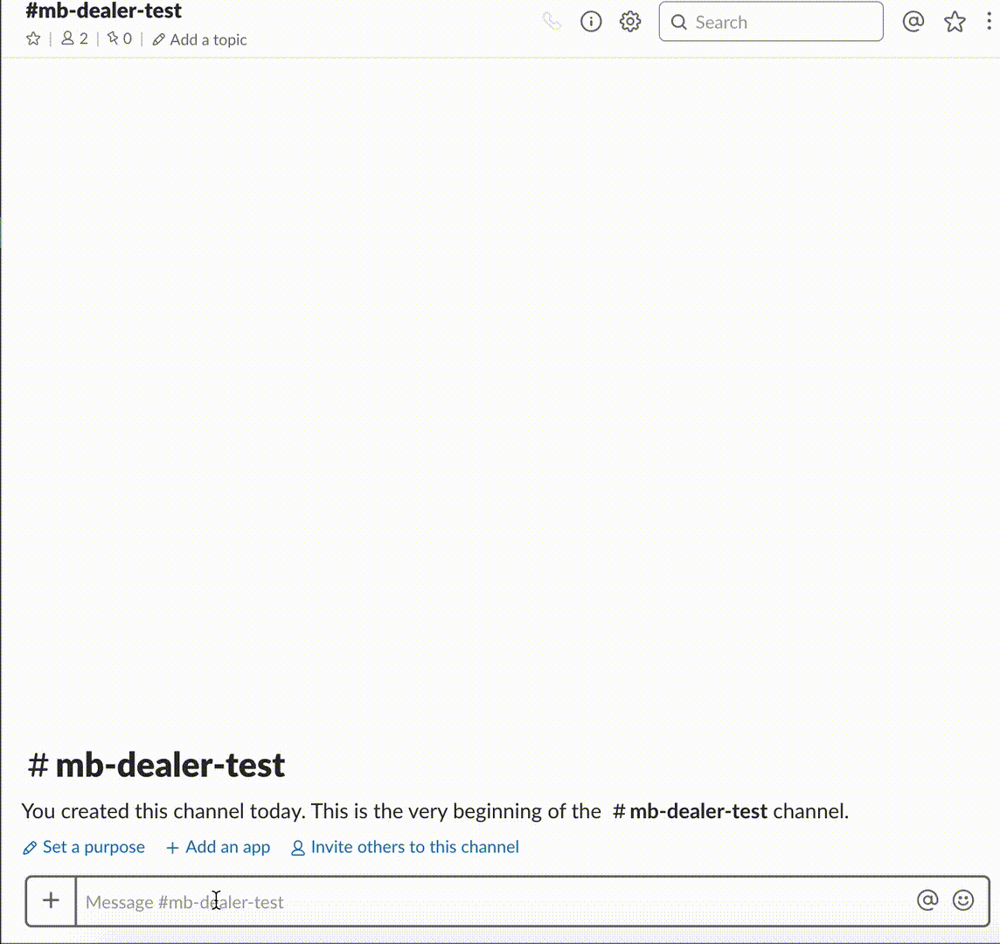

# Mercedes Benz Dealer Slack Bot
[](LICENSE)




## Features
- Get dealer info by typing dealer id GS0000000
- Finding dealer by country and activity (wizard flow)
- Geo cordinates points to google maps

## Prepositions
- Create slack bot and get token (https://my.slack.com/services/new/bot)
- Mercedes Benz API key (https://developer.mercedes-benz.com)

## Build and install

```bash
# clone the repo
git clone https://github.com/MarinX/go-mercedes-bot
# build go binary
go build
# run the binary with token and api key (required)
SLACK_KEY=<slack-token> MB_KEY=<mercedes api key>./go-mercedes-bot
```

## TODO
- Add more params for searching
- Multi-lang bot
- Tests

## License
This library is under the MIT License

## Author
Marin Basic 
